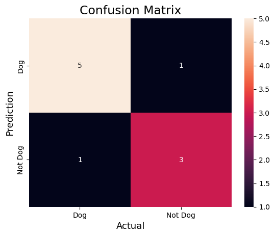

EEE4463 Confusion Matrix in Machine Learning using Python Tutorial
Created by: Dr. LEE Shu Chuen
Date: 10 Jun 2024

Example for binary classification problems

Index      1     2     3     4     5     6     7     8     9     10
Actual    Dog   Dog   Dog    x    Dog    x    Dog   Dog    x     x
Predicted Dog    x    Dog    x    Dog    Dog  Dog   Dog    x     x
Result     TP   FN    TP     TN   TP     FP   TP    TP     TN    TN


Actual Dog Counts = 6 
Actual Not Dog Counts = 4
True Positive Counts = 5
False Positive Counts = 1
True Negative Counts = 3
False Negative Counts = 1

Step 1: Import the necessary libraries


```python
import numpy as np
from sklearn.metrics import confusion_matrix,classification_report
import seaborn as sns
import matplotlib.pyplot as plt 
```

Step 2: Create the NumPy array for actual and predicted labels


```python
actual    = np.array(
  ['Dog','Dog','Dog','Not Dog','Dog','Not Dog','Dog','Dog','Not Dog','Not Dog'])
predicted = np.array(
  ['Dog','Not Dog','Dog','Not Dog','Dog','Dog','Dog','Dog','Not Dog','Not Dog'])
```

Step 3: Compute the confusion matrix


```python
cm = confusion_matrix(actual,predicted)
```

Step 4: Plot the confusion matrix with the help of the seaborn heatmap


```python
cm = confusion_matrix(actual,predicted)
sns.heatmap(cm, 
            annot=True,
            fmt='g', 
            xticklabels=['Dog','Not Dog'],
            yticklabels=['Dog','Not Dog'])
plt.ylabel('Prediction',fontsize=13)
plt.xlabel('Actual',fontsize=13)
plt.title('Confusion Matrix',fontsize=17)
plt.show()
```


    

    


Step 5: Classifications Report based on Confusion Metrics


```python
print(classification_report(actual, predicted))
```

                  precision    recall  f1-score   support
    
             Dog       0.83      0.83      0.83         6
         Not Dog       0.75      0.75      0.75         4
    
        accuracy                           0.80        10
       macro avg       0.79      0.79      0.79        10
    weighted avg       0.80      0.80      0.80        10
    


Conclusion
To sum up, the confusion matrix is an essential instrument for evaluating the effectiveness of classification models. Insights into a model’s accuracy, precision, recall, and general efficacy in classifying instances are provided by the thorough analysis of true positive, true negative, false positive, and false negative predictions it offers. The article provided examples to illustrate each metric’s computation and discussed its importance. It also demonstrated how confusion matrices can be implemented in Python for binary and multi-class classification scenarios. Practitioners can make well-informed decisions regarding model performance—particularly when dealing with imbalanced class distributions—by comprehending and applying these metrics.
